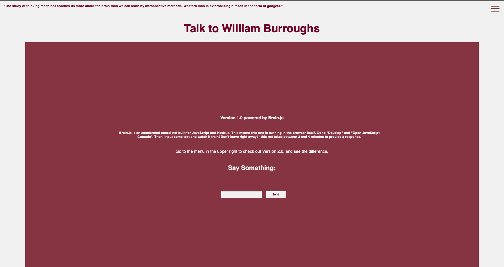
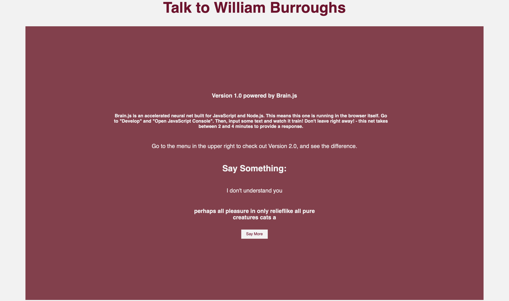
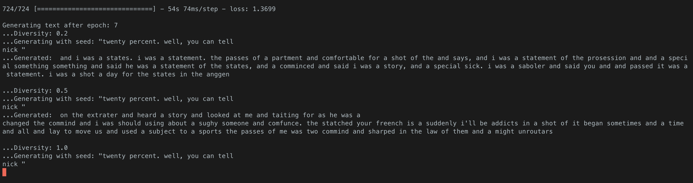
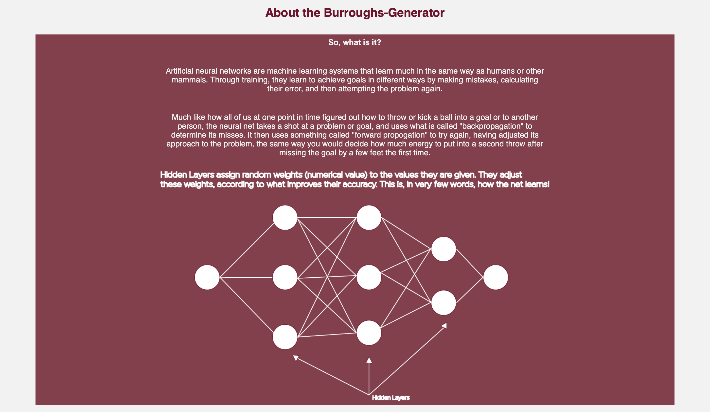

# Burroughs-Generator

### A text-generating neural network that simulates question and response with William Burroughs

#### Featuring Two LSTM Recurrent Neural Network Models:

##### V 1.0 Powered By Brain.js

As you access the site, you land on the Version 1.0 page. Here, there is some basic information about Brain.js.



Add input, and receive your response from Burroughs -- from a net not specifically designed for text-generation:



##### V 2.0 Powered By Keras & Tensorflow

Head to the menu in the top right to access Version 2.0. There is some basic information about the Keras LSTM model that was used.


Add input, and receive your response!

The Burroughs-Generator Version 2.0 is still facing fine-tuning of parameters, and its performance is limited by the amount of data available to train it on as well as the amount of time it takes to train with such massive amounts of data (hours to days).
This aspect of the Burroughs-Generator will continue to be improved, and soon the hope is to have a fully-functioning Generator
that provides sensical feedback based on user input!

Currently, the training sequence is going well, and the net is learning:



Special thanks to the writers at Keras for their resources on character-level text generating with LSTM. This part of the
project made possible by their documentation here: https://keras.io/examples/generative/lstm_character_level_text_generation/
As well as this article: https://towardsdatascience.com/generating-text-using-a-recurrent-neural-network-1c3bfee27a5e


#### Why Burroughs-Generator?

Machine learning has exploded in the last decade due to advances in the field and more and more industries
clamoring to adapt this new technology with so much potential. While Machine Learning is going to be the future of
many industries, and has the potential to solve problems that people and societies face, it is intimidating and inaccessible to many. Find any article on neural networks and machine learning and you are faced with technical terms from
computer science and mathematics. This can make this technology feel scary and malevolent to the average person. As viral videos on YouTube encourage this fear response for clicks, and documentaries appear about the negative effects of the algorithms at work behind the scenes of our social media accounts, it is important to provide understanding, so that individuals can genuinely understand the pros and cons of such technology.

The Burroughs-Generator aims to give the average person a chance to interact with this technology in a way that feels
approachable and playful. Additionally, an About page is presented with further information and resources to understand
what is going on behind the scenes. It is my hope that such practical and accessible examples of machine learning will
engage users, and encourage them to learn more and think critically about the information presented to them about this technology.



#### To Run:

Create your virtual environment:

```zsh
python3 -m venv env
```

Install dependencies:

```zsh
pip3 install -r requirements.txt
```

Activate:

```zsh
source bin/env/activate
```

Run:

```zsh
python3 app.py
```
