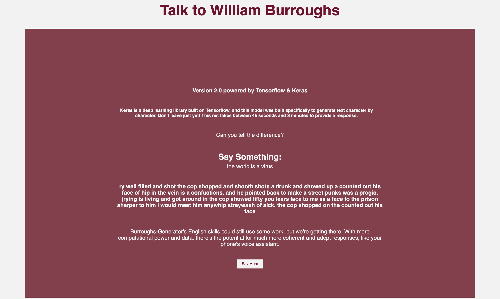

# Burroughs-Generator

### A text-generating neural network that simulates statement & response with author William Burroughs

#### Featuring Two LSTM Recurrent Neural Network Models:

##### V 1.0 Powered By Brain.js

Learn about browser based deep learning with Brain.js!


Add input, and receive your response from Burroughs:


##### V 2.0 Powered By Keras & Tensorflow

Head to the menu in the top right to access Version 2.0. Learn a bit about more professional-level deep learning with Keras.


Add input, and receive your response!



The Burroughs-Generator Version 2.0 net is still a little rough! The net was only given one novel (about 278,000 characters) to train on for 10 epochs. As a result, the net unfortunately has not learned or generalized as well as it could have. This model will continue undergo further optimizations.

Special thanks to the following resources, which provided me with invaluable support and starting points:

[Character level text generation with Keras](https://keras.io/examples/generative/lstm_character_level_text_generation/)

[Text generation with a recurrent neural network](https://towardsdatascience.com/generating-text-using-a-recurrent-neural-network-1c3bfee27a5e)


#### Why Burroughs-Generator?

Deep learning, a subset of machine learning, has exploded in the last decade. The discovery of effective hardware accelerators like GPUs, and the oftentimes fabulous performance of neural networks on unstructured data (like text!) are largely to thank for this explosion. As more and more industries clamor to adapt deep learning, it is still intimidating and inaccessible to many.

Most articles on neural networks and machine learning are chock full of terms from computer science and mathematics completely alien to the average person. This can make this technology feel scary to some, and unapproachable to others who may want to work with these technologies, but who aren't aware they can scale this intellectual barrier-to-entry.

Viral videos online encourage fear responses from lay-persons, throwing around "AI" and "Generalized AI" often as though they're one in the same. In this environment, as these technologies are more widely adopted, it is important to provide understanding, so that individuals both in and out of tech can genuinely weigh the pros and cons of such technology.

The Burroughs-Generator aims to give the average person a chance to interact with this technology in a way that feels
approachable and playful. Additionally, an About page is presented with further information and resources to understand
what is going on behind the scenes. This experiment was developed as a simple proof of concept with the goal of engaging its users to learn more about these technologies and think critically about their uses and limitations.


#### To Run:

Create your virtual environment:

```zsh
python3 -m venv env
```

Install dependencies:

```zsh
pip3 install -r requirements.txt
```

Activate:

```zsh
source bin/env/activate
```

Run:

```zsh
python3 app.py
```

#### Burroughs-Generator is now running at http://localhost:5000 <--- copy and paste this into your browser
